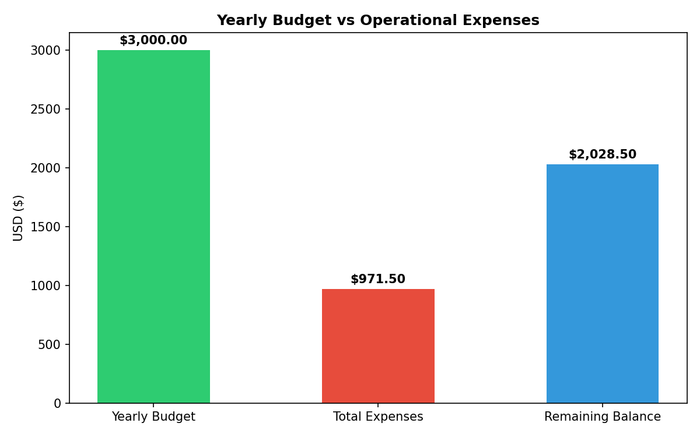

# LangGraph Invoice/Budget Analyzer

I made this automated budget analyzer to help me track my expenses. To use this, you add all your yearly expense invoices in PDF format, it prompts you to add your yearly budget in the terminal and then it tells you how much of your monthly budget you've exhausted (also with a chart) and which your top paid vendors are this year.

## It Uses
**LangChain** for LLM management and a **LangGraph** agent to extract financial metrics from markdown invoices into **PostgreSQL** with **concurrent LLM processing** and expense visualization through **Matplotlib**.

## What Helped

- PostgreSQL retains the relational db format which made it super easy to maintain the tabular form our markdown files had.
- When you use different LLM providers, managing keys becomes a hassle. OpenRouter is one unified platform making it easier for you. And it even got some models offering free tiers for rapid testing.
- psycopg2 connections themselves are not entirely thread-safe to share across multiple concurrent workers, so opening a fresh connection per thread is a safe approach. Although opening and closing physical database connections over and over inside a threaded loop adds connection overhead and can hit database connection limits if your worker count grows. If you scale max_workers beyond 10, you'll want to swap that out for a thread-safe connection pool (like psycopg2.pool.ThreadedConnectionPool).

## Visual



## What You See on the Terminal

After cloning this repo, installing dependencies and adding your PDF invoices, it will prompt your budget and click Enter to see your most expensive purchases and track how much balance you've remaining after your paid invoices.


## Prerequisites

Before starting, ensure you have the following installed:

- Python 3.10+
- PostgreSQL 14+ (running locally or via a cloud provider)
- pip and venv
- An OpenRouter account and API key

## Installation on Linux (Ubuntu)

Clone the repository, Create and Activate a Virtual Environment (Ubuntu)
```bash
git clone https://github.com/mariyamhere/langgraph-budget-analyzer.git
cd langgraph-budget-analyzer
python3 -m venv venv
source venv/bin/activate
```

Install dependencies
```bash
pip install -r requirements.txt
```
## Creating Secret Variables

Populate your .env file
```bash
DB_HOST=localhost
DB_PORT=5432
DB_NAME=budget_analyzer #you may choose a different one
DB_USER=your_postgres_user #you may choose a different one
DB_PASSWORD=your_postgres_password #you may choose a different one
OPENROUTER_API_KEY=your_openrouter_api_key #get from https://openrouter.ai > Settings (after signup)
LLM_MODEL=meta-llama/llama-3-70b-instruct:free #you may choose a different one
```

## Adding Your PDFs

Create a pdf_invoices folder in your project's base directory and drop your target invoices inside
```bash
mkdir pdf_invoices
#move your files into the directory
```

Run the scripts in this order
```bash
python3 pdf_to_markdown.py
python3 markdown_to_db.py
python3 LangGraph_agent.py
python3 visualization.py
python3 main.py
#make sure you're in the respective directory

```

